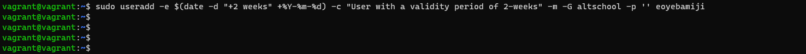
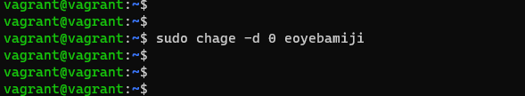
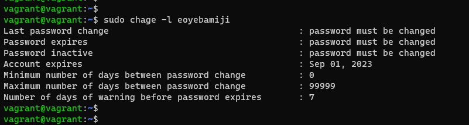
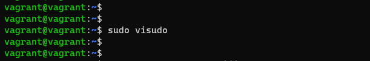
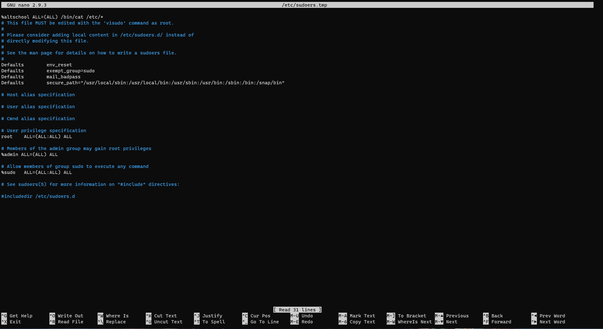
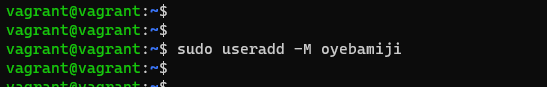
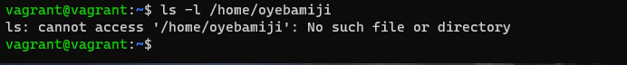

## AltSchool SOE-Cloud Assignment

### Create a group "AltSchool"
```bash
sudo addgroup "GroupName"
```


### Create a user, add the user to the created group and set the user to expire after two (2) weeks.
```bash
sudo useradd -e $(date -d "+2 weeks" +%Y-%m-%d) -c "(Optional) Prefered comment" -m -G altschool -p '' "UserName"
```


### Modify the created user to change password on login.
```bash
sudo chage -d 0 "UserName"
```


### Confirm/Verify the set validity of the created user.
```bash
sudo chage -l "UserName"
```


### Edit the permissions of the group "AltSchool"
Modify the permissions of the group "AltSchool"
```bash
sudo visudo
```

Modify the configuration of the group "AltSchool" with the below permissions
```bash
%altschool ALL=(ALL) /bin/cat /etc/*
```


### Create a new user with no home directory
```bash
sudo useradd -M "NewUser"
```


### Confirm the new user does not have the home directory

```bash
ls -l /home/"NewUser"
```


